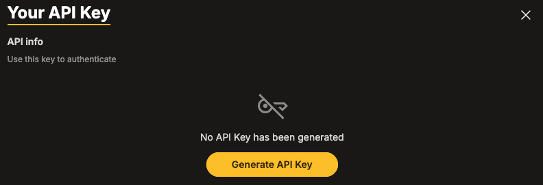
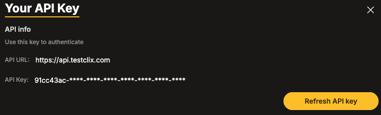

import { Badge, Steps, Tabs, TabItem } from '@astrojs/starlight/components';
import generateKey from '../../../assets/api/generate_api_key.png';

## Introduction

The **TestCLIX** API allows you to integrate external systems with your workspace.
Access to the API requires a valid **API Key**.

## Authentication

All API requests must include your API key in the request header:

```http
x-api-key: YOUR_API_KEY
```

#### Example 

```bash
curl https://api.testclix.com/v1/api/status -H "x-api-key: {YOUR_API_KEY}"
```
If the key is missing the API returns:

##### 401 Response

```json
{
  "message": "Unauthorized"
}
```

If the key is invalid the API returns:

##### 403 Response

```json
{
  "message": "User is not authorized to access this resource with an explicit deny in an identity-based policy"
}
```

## API Key Management

To manage your API key:

<Steps>
    1. Open **Settings** from the left sidebar.

    2. Navigate to **Your API Key**.
</Steps>

<Tabs>
  <TabItem label="No API Key Generated">

    When accessing the API section for the first time, no key is available.
    - Message: **"No API Key has been generated"**
    - Button: **Generate API Key**

    #### Generate a New API Key

    <Steps>

    1. Click the **Generate API Key** button.

    2. The system automatically creates a unique **API key** for your workspace.

    3. The **API key** and API URL are displayed.

    4. Copy and securely store the **API key**.
      
    </Steps>

    :::note
    The **API key** grants access to your workspace data.
    Store it securely and never expose it in public repositories.
    :::
  </TabItem>
  <TabItem label="API Key Already Exists">
    If an **API key** has already been generated, the panel displays:

        - API URL

        - Masked API Key

        - **Refresh API Key** button

  #### Refreshing the API Key

  If your API key has been compromised or needs to be rotated:

  <Steps>

  1. Click the Refresh API key button.

  2. Confirm the action.

  3. A new **API key** is generated.

  4. Update all external systems using the old key.
    
  </Steps>

  :::note
  Refreshing the **API key** immediately invalidates the previous key.
  All integrations using the old key will stop working until updated.
  :::
  </TabItem>
</Tabs>

## Endpoints

Available endpoints.

| Method        | Endpoint                   | Description               |Params          |	Codes        |
|---------------|----------------------------|---------------------------|----------------|--------------|
| `GET`         | `/v1/api/status`           | Get scenario status       | None           | 200          |
| `GET`         | `/v1/api/status/details`   | Get scenario details      | None           | 200          |
| `GET`         | `/v1/api/status/{test_id}` | Get scenario status by ID | test_id(string)| 200, 404     |
| `POST`        | `/v1/api/execute/{test_id}`| Execute scenario by ID    | test_id(string)| 200, 403, 404|

### Get Scenario Status

`GET /v1/api/status`

Returns overall scenario status.

#### Example Request

```bash
curl https://api.testclix.com/v1/api/status -H "x-api-key: {YOUR_API_KEY}"
```

##### 200 Response

```json
{
  "status": "pass"
}
```

### Get Scenario Details

`GET /v1/api/status/details`

Returns detailed scenario results.

#### Example Request

```bash
curl https://api.testclix.com/v1/api/status/details -H "x-api-key: {YOUR_API_KEY}"
```

##### 200 Response

```json
{
  "status": "pass",
  "tests": {
    "error": {
      "count": 0,
      "items": []
    }
  }
}
```
### Get Scenario Status by ID

`GET /v1/api/status/{test_id}`

Returns status of a specific scenario.

#### Path Parameter

| Name        | Type       | Description  |
|-------------|------------|--------------|
| test_id     | string     | Scenario ID  |
                                                        
#### Example Request

```bash
curl https://api.testclix.com/v1/api/status/{test_id} -H "x-api-key: {YOUR_API_KEY"}
```

##### 200 Response

```json
{
  "test_id": "01GDZYY7EMI1&07GD8QUVVINJDI",
  "status": "not recorded"
}
```

##### 404 Response

```json
{
  "message": "Scenario doesn't exists"
}
```

### Execute Scenario

`POST /v1/api/execute/{test_id}`

Triggers execution of **[Website Scenario](/website-scenario/overview)**. The limit of executions is defined by your Website Scenario Execution package.

**[Website Availability](/website-availability/overview)**, and **[Website Vitals](/website-vitals/overview)** cannot be run using API yet.


#### Path Parameter


| Name        | Type       | Description  |
|-------------|------------|--------------|
| test_id     | string     | Scenario ID  |
                                                        


#### Example Request

```bash
curl -X POST https://api.testclix.com/v1/api/execute/{test_id} -H "x-api-key: {YOUR_API_KEY"}
```

##### 200 Response

```json
{
  "test_id": "01GDZYY7EMI1&07GD8QUVVINJDI",
  "status": "queued"
}
```

##### 403 Response — Execution Limit Exceeded

```json
{
  "message": "Execution limit exceeded"
}
```

##### 404 Response

```json
{
  "message": "Scenario doesn't exists"
}
```

#### HTTP Status Code Summary

| Code                                 | Meaning                   | 
|--------------------------------------|---------------------------|
| <Badge text="200" variant="success"/>| Success                   | 
| <Badge text="403" variant="danger"/> | Execution limit exceeded  |
| <Badge text="404" variant="danger"/> | Scenario doesn't exists   |

