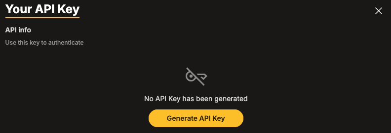
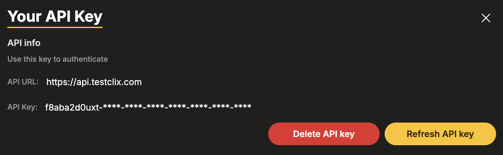

import { Badge, Steps, Tabs, TabItem } from '@astrojs/starlight/components';
import generateKey from '../../../assets/api/generate_api_key.png';

## Introduction

The **TestCLIX** API allows you to integrate external systems with your workspace.
Access to the API requires a valid **API Key**.

## Authentication

All API requests must include your API key in the request header:

```http
x-api-key: YOUR_API_KEY
```

#### Example 

```bash
curl https://api.testclix.com/v1/api/status -H "x-api-key: {YOUR_API_KEY}"
```
If the key is missing the API returns:

##### 401 Response

```json
{
  "message": "Unauthorized"
}
```

If the key is invalid the API returns:

##### 403 Response

```json
{
  "message": "User is not authorized to access this resource with an explicit deny in an identity-based policy"
}
```

## API Key Management

The API key is scoped to the **currently selected project**, and managing it requires the **Admin** or **Owner** role - see [Roles & Permissions](/project-management/permissions).

To manage your API key:

<Steps>
    1. Open **Settings** from the left sidebar.

    2. Navigate to **Your API Key**.
</Steps>

The **Your API Key** panel adapts to whether a key already exists:

- **No API Key generated** - shows the message *"No API Key has been generated"* and a **Generate API Key** button.
- **API Key exists** - shows the API URL, the masked API key, and the **Refresh API Key** and **Delete API Key** buttons.

<Tabs>
  <TabItem label="Generate">

    When accessing the API section for the first time, no key is available.

    <Steps>

    1. Click the **Generate API Key** button.

    2. The system automatically creates a unique **API key** for your workspace.

    3. The **API key** and API URL are displayed.

    4. Copy and securely store the **API key**.
      
    </Steps>

    :::note
    The **API key** grants access to your workspace data.
    Store it securely and never expose it in public repositories.
    :::
  </TabItem>
  <TabItem label="Refresh">

    If your API key has been compromised or needs to be rotated:

    <Steps>

    1. Click the **Refresh API Key** button.

    2. Confirm the action.

    3. A new **API key** is generated.

    4. Update all external systems using the old key.
      
    </Steps>

    :::note
    Refreshing the **API key** immediately invalidates the previous key.
    All integrations using the old key will stop working until updated.
    :::
  </TabItem>
  <TabItem label="Delete">

    If you no longer need API access for this project, you can permanently delete the key:

    <Steps>

    1. Click the **Delete API Key** button.

    2. In the confirmation dialog, review the message:
       *"Are you sure you want to delete this API key? After this action, the current API key will no longer work."*

    3. Click **Delete** to confirm.

    4. The **API key** is removed, and the panel returns to the **No API Key generated** state.
      
    </Steps>

    :::caution
    Deleting the **API key** takes effect immediately and cannot be undone.
    All integrations using this key will stop working right away.
    To restore access, generate a new **API key** and update your external systems.
    :::
  </TabItem>
</Tabs>

## Endpoints

Available endpoints.

| Method        | Endpoint                   | Description               |Params          |	Codes        |
|---------------|----------------------------|---------------------------|----------------|--------------|
| `GET`         | `/v1/api/status`           | Get test status       | None           | 200          |
| `GET`         | `/v1/api/status/details`   | Get test details      | None           | 200          |
| `GET`         | `/v1/api/status/{test_id}` | Get test status by ID | test_id(string)| 200, 404     |
| `POST`        | `/v1/api/execute/{test_id}`| Execute test by ID    | test_id(string)| 200, 403, 404|
| `GET`         | `/v1/api/history/{test_id}`| Get run history by ID | test_id(string)| 200          |
| `GET`         | `/v1/api/har/{test_id}`    | Download run HAR file | test_id(string)| 302, 404     |

### Get Test Status

`GET /v1/api/status`

Returns overall test status.

#### Example Request

```bash
curl https://api.testclix.com/v1/api/status -H "x-api-key: {YOUR_API_KEY}"
```

##### 200 Response

```json
{
  "status": "pass"
}
```

### Get Test Details

`GET /v1/api/status/details`

Returns detailed test results.

#### Example Request

```bash
curl https://api.testclix.com/v1/api/status/details -H "x-api-key: {YOUR_API_KEY}"
```

##### 200 Response

```json
{
  "status": "pass",
  "tests": {
    "error": {
      "count": 0,
      "items": []
    }
  }
}
```
### Get Test Status by ID

`GET /v1/api/status/{test_id}`

Returns status of a specific test.

#### Path Parameter

| Name        | Type       | Description  |
|-------------|------------|--------------|
| test_id     | string     | Test ID      |

#### Example Request

```bash
curl https://api.testclix.com/v1/api/status/{test_id} -H "x-api-key: {YOUR_API_KEY"}
```

##### 200 Response

```json
{
  "test_id": "01GDZYY7EMI1&07GD8QUVVINJDI",
  "status": "not recorded"
}
```

##### 404 Response

```json
{
  "message": "Test doesn't exist"
}
```

### Execute Test

`POST /v1/api/execute/{test_id}`

Triggers execution of a **[Website Scenario](/website-scenario/overview)**, **[Website Availability](/website-availability/overview)**, or **[Website Vitals](/website-vitals/overview)** test.
The limit of executions is defined by your Test Execution package.


#### Path Parameter


| Name        | Type       | Description  |
|-------------|------------|--------------|
| test_id     | string     | Test ID      |


#### Example Request

```bash
curl -X POST https://api.testclix.com/v1/api/execute/{test_id} -H "x-api-key: {YOUR_API_KEY"}
```

##### 200 Response

```json
{
  "test_id": "01GDZYY7EMI1&07GD8QUVVINJDI",
  "status": "queued"
}
```

##### 403 Response - Execution Limit Exceeded

```json
{
  "message": "Execution limit exceeded"
}
```

##### 404 Response

```json
{
  "message": "Test doesn't exist"
}
```

#### HTTP Status Code Summary

| Code                                 | Meaning                   | 
|--------------------------------------|---------------------------|
| <Badge text="200" variant="success"/>| Success                   | 
| <Badge text="403" variant="danger"/> | Execution limit exceeded  |
| <Badge text="404" variant="danger"/> | Test doesn't exist        |

### Get Run History

`GET /v1/api/history/{test_id}`

Returns the run history of a specific test, newest first.

#### Path Parameter

| Name        | Type       | Description  |
|-------------|------------|--------------|
| test_id     | string     | Test ID  |

#### Query Parameters

All query parameters are optional.

| Name            | Type   | Description                                     |
|-----------------|--------|-------------------------------------------------|
| limit           | number | Maximum number of items to return (default: 100)|
| last_created_at | string | Pagination cursor - pass the `last_key` value from the previous response |
| status          | string | Only return runs with this status               |
| test_version    | string | Only return runs of this test version           |
| created_at      | string | Only return entries whose timestamp starts with this prefix (e.g. `2026-07`) |
| type            | string | `run` returns only test runs; `test_status` returns only status-change entries |

#### Example Request

```bash
curl https://api.testclix.com/v1/api/history/{test_id} -H "x-api-key: {YOUR_API_KEY}"
```

##### 200 Response

```json
{
  "count": 2,
  "items": [
    {
      "created_at": "2026-07-30T09:15:12",
      "status": "pass",
      "message": "",
      "test_version": "3",
      "trigger": "scheduler",
      "har_file": "USER#0451…/01GDZYY7EMI1&07GD8QUVVINJDI/2c9a….har"
    },
    {
      "created_at": "2026-07-30T08:15:09",
      "status": "error",
      "message": "Timeout while loading page",
      "test_version": "3",
      "trigger": "scheduler",
      "har_file": ""
    }
  ],
  "last_key": "2026-07-30T08:15:09"
}
```

The fields present on each item depend on the test type (for example,
**Website Vitals** runs include `vitals_results`).

A non-empty `har_file` means the run has a HAR file available - use the
item's `created_at` with the [HAR endpoint](#download-har-file) to
download it.

`last_key` is only present when more items are available. Pass it as
`last_created_at` in the next request to fetch the next page.

An unknown test ID returns an empty list (`"count": 0`).

### Download HAR File

`GET /v1/api/har/{test_id}`

Downloads the HAR file recorded by a run of a specific test.
HAR files are only recorded for
**[Website Scenario](/website-scenario/overview)** tests with
**[Performance Audit](/website-scenario/performance-audit)** enabled.
Other test types never produce HAR files.

By default the newest run with a HAR file is used. Pass `created_at`
to download the HAR file of a specific run.

The endpoint responds with a **302 redirect** to a signed download URL
that is valid for **10 minutes**. Use `curl -L` (or your HTTP client's
follow-redirects option) to download the file in one step.

#### Path Parameter

| Name        | Type       | Description  |
|-------------|------------|--------------|
| test_id     | string     | Test ID  |

#### Query Parameter

| Name        | Type       | Description  |
|-------------|------------|--------------|
| created_at  | string     | Optional. Run timestamp, as returned by the [run history endpoint](#get-run-history) |

#### Example Request

```bash
curl -L https://api.testclix.com/v1/api/har/{test_id} -H "x-api-key: {YOUR_API_KEY}" -o run.har
```

##### 404 Responses

```json
{
  "message": "No run with a HAR file"
}
```

```json
{
  "message": "Run doesn't exist"
}
```

```json
{
  "message": "Run has no HAR file"
}
```

```json
{
  "message": "HAR file has expired"
}
```

HAR files are removed after **30 days** - see
[HAR File Retention](/website-scenario/performance-audit#har-file-retention).

#### HTTP Status Code Summary

| Code                                 | Meaning                                        | 
|--------------------------------------|------------------------------------------------|
| <Badge text="302" variant="success"/>| Redirect to the signed HAR download URL        | 
| <Badge text="404" variant="danger"/> | No matching run, no HAR file, or HAR expired   |

