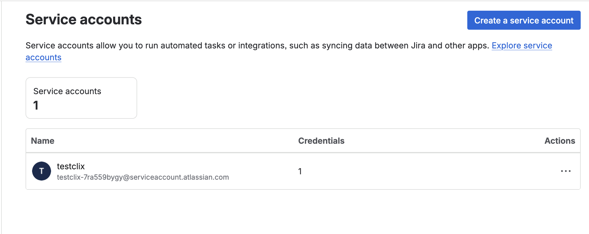
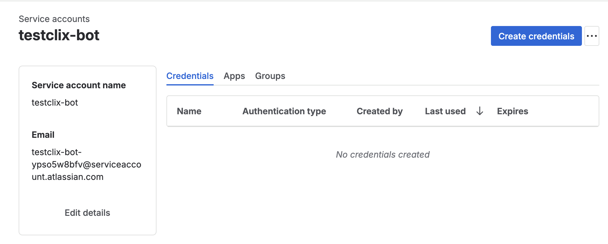
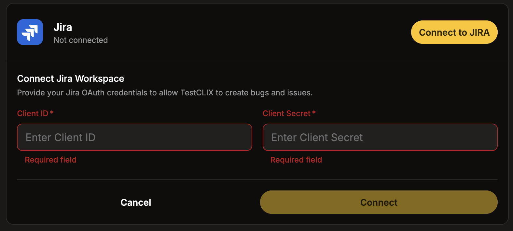
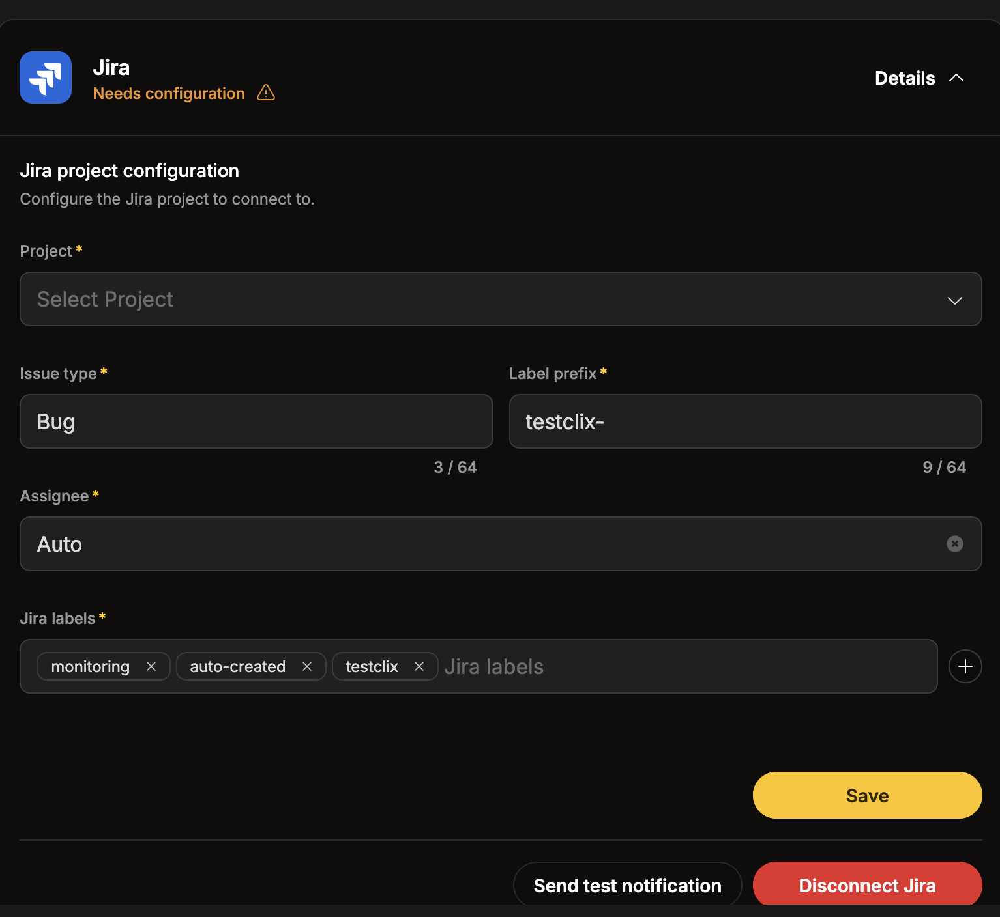
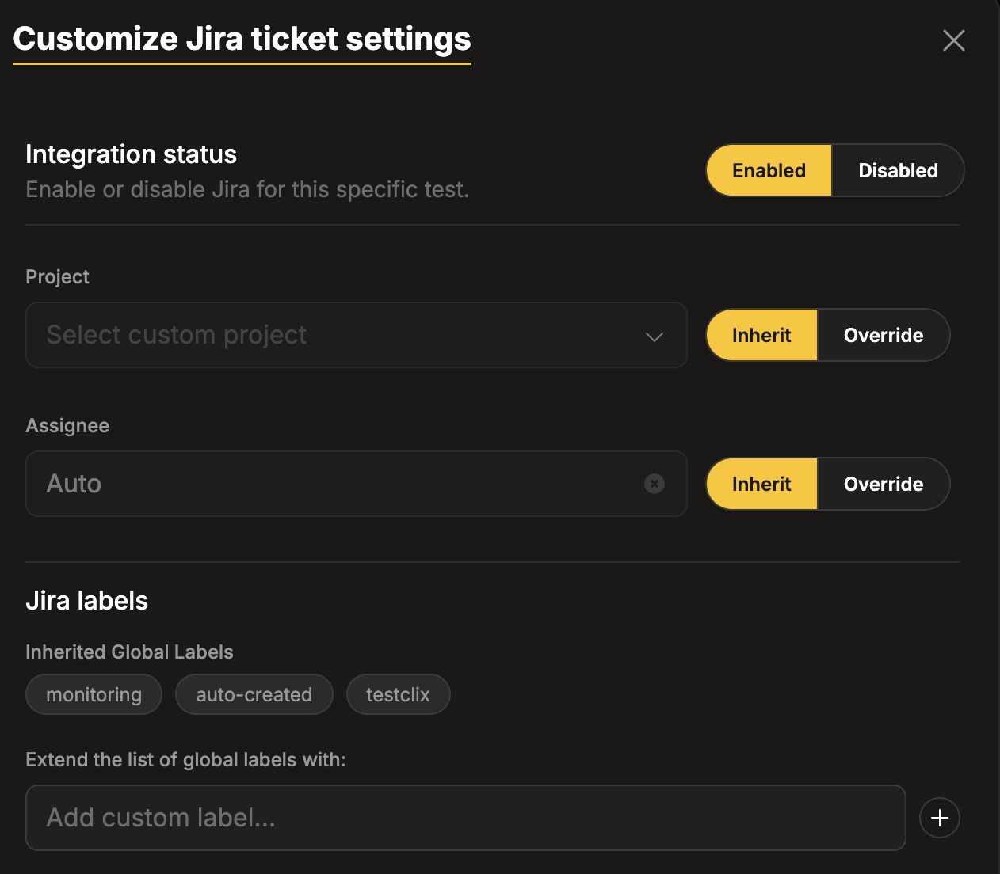

import { Badge, Steps } from '@astrojs/starlight/components';
import jiraSidebar from '../../../assets/jira/jira_sidebar.png';
import createServiceAccount from '../../../assets/jira/create_a_service_account.png';
import createCredentials from '../../../assets/jira/create_credetials.png';
import jiraConnect from '../../../assets/jira/jira_connect.png';
import jiraConfiguration from '../../../assets/jira/Jira_configuration.png';
import jiraCustomizeTicket from '../../../assets/jira/jira_customize_ticket.png';

## Introduction

Integrating **TestCLIX** with Jira allows automatic creation of Jira issues whenever a test transitions to the <Badge text="Error" variant="danger"/> status.
It ensures that failures are immediately tracked in your project board, reducing response times and improving visibility.

### What You Get

- **Automatic issue creation** in your Jira project when a test fails.
- **Duplicate prevention** – only one open issue per test at a time.
- **Configurable** project, issue type, labels, and assignee.
- **Per-test overrides** to route issues to different projects or assignees.

## Connecting to Jira

The Jira integration uses an Atlassian service account with OAuth 2.0 credentials. This requires creating a service account in Atlassian Admin before connecting in **TestCLIX**.

### Step 1: Create a Service Account

<Steps>

1. Go to <a href="https://admin.atlassian.com" target="_blank">Atlassian Admin</a>.

2. In the left sidebar, navigate to **Directory** → **Service accounts**.

   

3. Click **Create service account**.

   

4. Fill in the **Name** (e.g. `testclix`) and optionally a **Description**.

5. Select which Jira instances the service account should have access to. **User** access is sufficient.

</Steps>

### Step 2: Create OAuth 2.0 Credentials

<Steps>

1. Open the newly created service account page.

2. Click **Create credentials**.

   

3. Select **OAuth 2.0**.

4. Provide a name for the credential (e.g. `TestCLIXAPIKey`).

5. Click **Next** and grant the following permissions:
   - `read:jira-work` – read projects and issues, used for duplicate detection.
   - `write:jira-work` – create Jira issues on test failure.
   - `read:jira-user` – search users for the assignee picker.

6. Click **Next** to review the credentials, then click **Create**.

7. The **Client ID** and **Client Secret** will appear on the screen. Copy and store them securely.

</Steps>

### Step 3: Connect Jira in TestCLIX

<Steps>

1. Open **Settings** from the left sidebar menu, then select the **Integrations** tab.

2. Click **Connect Jira**. A dialog will ask for the **Client ID** and **Client Secret** from the previous step.

   

3. Click **Connect**. TestCLIX validates the credentials and discovers your Jira site automatically.

4. If the connection is successful, the Jira configuration panel is displayed.

   

5. Select the **Project** in which issues should be created. The project list is loaded automatically from Jira. If the projects are not listed, the permissions in [Step 2](#step-2-create-oauth-20-credentials) were incorrectly configured – please revisit the OAuth 2.0 permissions.

6. Click **Save** to complete the connection.

7. Click **Send test notification** to verify the integration. A test ticket should appear in your Jira project. If something is misconfigured, an error will be reported.

</Steps>

## Configuring the Integration

Once connected, you can further customize how Jira issues are created.

### Issue Type

The default issue type is **Bug**, but your project might not use it. Select a different issue type if needed.

### Label Prefix

A prefix used to generate a test-specific label (e.g. `testclix-`), which is combined with the test ID for [duplicate detection](#duplicate-prevention).

:::caution
Changing the label prefix after issues have already been created may result in duplicate issues, as existing issues will no longer match the new label format.
:::

### Assignee

Control who gets assigned to created issues. The default value is **Auto**, which uses the Jira project's default assignee. To assign issues to a specific person, select a user from the dropdown list. The list of users is loaded from Jira.

### Labels

Optionally configure additional labels that will be added to every created issue.

### Saving and Testing

After configuring the integration, click **Save** to apply the settings. To verify the integration is working correctly, click **Send test notification** – this will create a test ticket in your Jira project or report an error if something goes wrong.

:::note
Test notifications always create a new issue regardless of [duplicate prevention](#duplicate-prevention) rules.
:::

### Disconnecting Jira

If Jira issue creation is no longer needed, the integration can be safely removed at any time.

1. Open the Jira integration details in the **Integrations** tab.
2. Click the **Disconnect Jira** button.
3. Once disconnected, no further Jira issues will be created.

:::note
Jira can be reconnected at any time by repeating the setup process.
:::

## Jira Issue Format

When a test fails, the created issue contains:

- **Summary:** `Test Failed: {test_name}`
- **Description:** Error message with a link to the test in TestCLIX.
- **Labels:** Configured labels plus a test-specific label for duplicate detection.
- **Reporter:** The service account.
- **Assignee:** Based on the configured assignee mode.

## Per-Test Overrides

Individual tests can override the global Jira settings. This option is only available when editing an existing test, not during creation.

<Steps>

1. Navigate to **Workspace** using the left sidebar menu.

2. Locate the test you want to modify.

3. Click **...** on the right side of the window and select **Customize jira settings**.

4. Adjust the settings as needed:

   

   - **Integration status** – disable Jira issue creation for this specific test.
   - **Project** – override the global project.
   - **Assignee** – override the assignee (Auto or a specific user).
   - **Jira labels** – add additional labels for this test. These are added on top of the global labels, not replacing them.

</Steps>

## Duplicate Prevention

**TestCLIX** checks for existing open Jira issues before creating a new one. If an open issue with the matching test label already exists, creation is skipped.

This means a test can keep failing without flooding Jira – only one issue per test exists at a time.
Once the existing issue is moved to a **Done** status (e.g. Closed, Resolved), the next failure will create a new issue.
