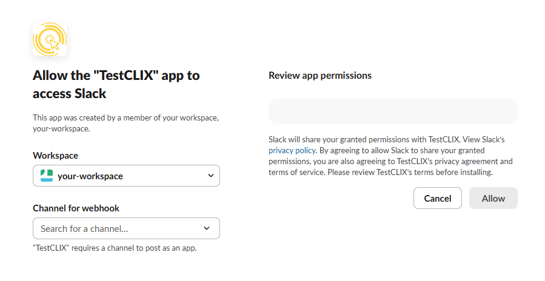
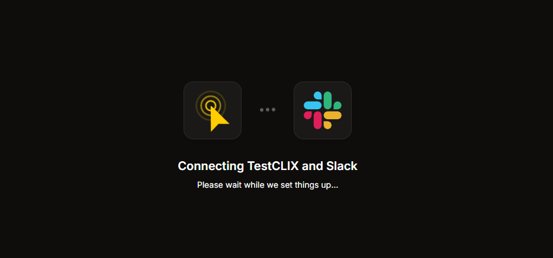
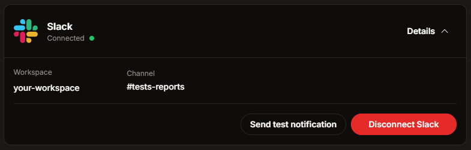

import { Steps } from '@astrojs/starlight/components';

## Introduction

Integrating **TestCLIX** with Slack allows receiving instant notifications in the Slack workspace whenever any tests fail. 
It ensures immediate awareness of any issues, reducing response times and improving visibility.

### What You Get

- **Real-time alerts** on the chosen Slack channel.
- Notifications triggered for **any failed test** (works for all types of tests).
- Clean channel history - notifications are only sent on failure.

## Connecting to Slack

The Slack integration can be connected and managed directly from the application **Settings**.

<Steps>

1. Open **Settings** from the left sidebar menu.

2. Select the **Integrations** tab.

3. If Slack is not connected, a **Connect to slack** button is displayed. Click it to start the process.
   
   

4. The authorization process redirects to the Slack page. Here, choose a **Channel for webhook** where the error notifications will be posted. The workspace is selected automatically by default, but it can be changed if needed.
   
   :::note
   Appropriate permissions in the selected Slack workspace are required to add new integrations. If these permissions are missing, Slack will display a corresponding error message.
   :::

   

5. Confirm the selection by clicking **Allow**. The process then redirects back to the TestCLIX application.

   

6. If the entire process is successful, a success message is displayed, and the Slack integration panel shows a **Connected** status.

   

</Steps>

## Managing the Integration

Once connected, details of the Slack integration can be viewed and managed in the **Integrations** tab.

### Integration Details

Expand the Slack integration panel to view specific details about the connection. It will display:
- The **workspace** the account is connected to.
- The **channel** assigned to receive notifications.

### Testing the Connection

To ensure the integration is working correctly, a test notification can be triggered manually.

1. In the Slack integration details, click the **Send test notification** button.
2. Check the selected Slack channel. A test message confirming the connection should be received.

### Disconnecting Slack

If Slack notifications are no longer needed, the integration can be safely removed at any time.

1. Open the Slack integration details in the **Integrations** tab.
2. Click the **Disconnect Slack** button.
3. Once disconnected, all messages and notifications to Slack will immediately stop.

:::note
Slack can be reconnected at any time by repeating the initial setup process.
:::
