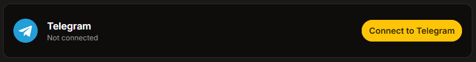
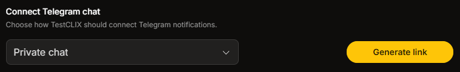
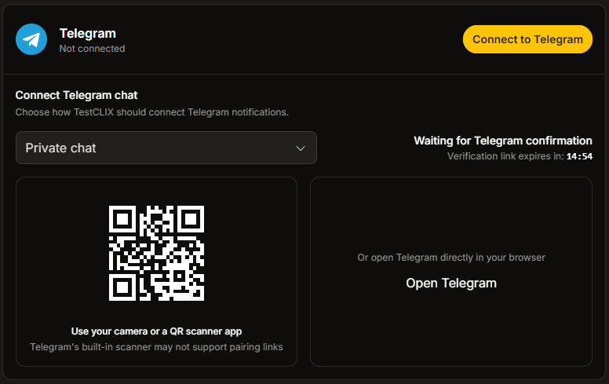
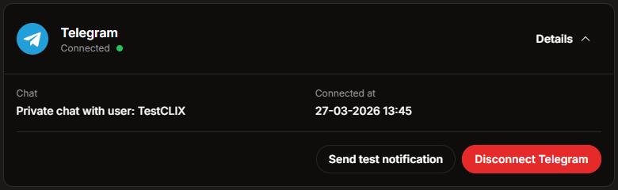
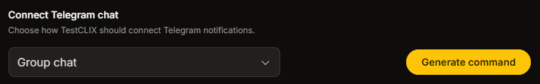
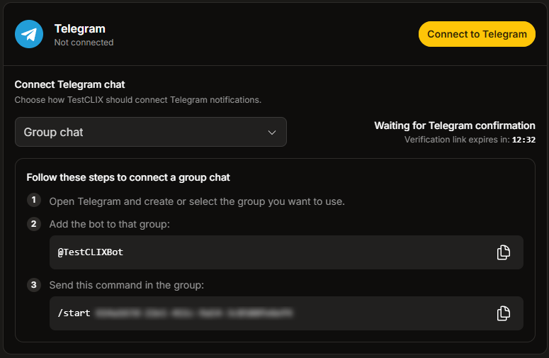
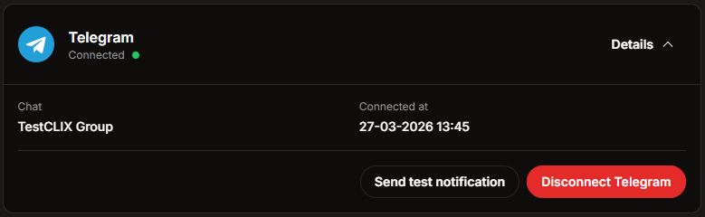

import { Steps, Tabs, TabItem } from '@astrojs/starlight/components';

## Introduction

Integrating **TestCLIX** with Telegram allows you to receive test failure notifications directly in Telegram.

You can connect notifications to:

- A **private chat** with the TestCLIX bot
- A **group chat** where the TestCLIX bot has been added

This gives your team a simple way to keep test alerts visible in the place where you already communicate.

## Official Bot

To make sure you are connecting to the correct Telegram bot, always use one of the official references below:

Use this official bot link: **[TestCLIXBot](https://t.me/TestCLIXBot)**

You can also verify the bot by its Telegram username: `@TestCLIXBot`.

:::note
If you are ever unsure whether a Telegram link, QR code, or bot profile is legitimate, compare it with the official references in this section before continuing.
:::

## Connecting to Telegram

You can connect and manage Telegram notifications directly from the application **Settings**. Configuring them requires the **Admin** or **Owner** role in the current project - see [Roles & Permissions](/project-management/permissions).

<Tabs>
  <TabItem label="Private chat" icon="user">

The private chat option is best when notifications should be delivered directly to one Telegram account.

<Steps>

1. Open **Settings** from the left sidebar menu.

2. Select the **Integrations** tab.

3. If Telegram is not connected, a **Connect to Telegram** button is displayed. Click it to start the process.

   

4. Choose **Private chat** and click **Generate link**.

   

5. Start the connection using one of these options:
   - Click **Open Telegram** to open the bot directly.
   - Scan the displayed **QR code** using your phone camera or any QR scanning app.

   

   :::tip
   For QR codes, use your phone camera or a dedicated QR scanning app.
   The built-in scanner inside Telegram is not recommended, because it may not read this type of QR code correctly.
   :::

6. In Telegram, open the chat with the bot and click **Start**.

7. Return to **TestCLIX** and wait until the integration status changes to **Connected**.

   

</Steps>

  </TabItem>
  <TabItem label="Group chat" icon="seti:telegram">

The group chat option is useful when the whole team should see alerts in a shared Telegram conversation.

<Steps>

1. Open **Settings** from the left sidebar menu.

2. Select the **Integrations** tab.

3. If Telegram is not connected, a **Connect to Telegram** button is displayed. Click it to start the process.

   

4. Choose **Group chat** and click **Generate command**.

   

5. Follow inner instructions to connect the bot to your Telegram group.

   

   1. Add the [TestCLIX Bot](https://t.me/TestCLIXBot) to your Telegram group.

   2. Copy the command shown in the integration panel.

   3. Send that command in the Telegram group to confirm the connection.

8. Return to **TestCLIX** and wait until the integration status changes to **Connected**.

   

</Steps>

  </TabItem>
</Tabs>

## Managing the Integration

Once Telegram is connected, the integration panel shows the current chat details and available actions.

It can display:

- The name of the connected chat
- The date when the integration was connected
- The current connection status

### Send a Test Notification

To confirm that everything is working correctly:

<Steps>

1. Open the connected Telegram integration details.

2. Click **Send test notification**.

3. Check the connected Telegram chat and confirm that the message has arrived.

</Steps>

### Disconnect Telegram

If Telegram notifications are no longer needed, the integration can be removed at any time.

<Steps>

1. Open the connected Telegram integration details.

2. Click **Disconnect Telegram**.

3. Confirm that the integration status returns to the disconnected state.

</Steps>

:::note
After disconnecting Telegram, TestCLIX will stop sending notifications to that chat until the integration is connected again.
:::
