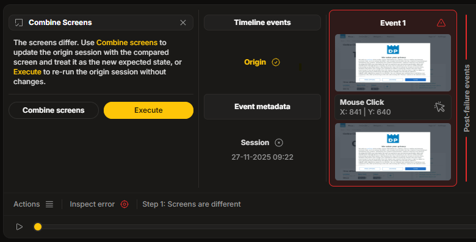

**Combine Screens** is a powerful validation tool that allows you to resolve visual discrepancies directly from the Session Player.

## Prerequisites

This feature is available **only** when the **Pixel Compare** option is enabled for the test.

## How It Works

When a test fails due to visual differences between the **origin** and the **error** session, the **Combine Screens** functionality enables you to manually accept the new state as valid.

:::note[Context]
The screens differ. Use Combine screens to update the origin session with the compared screen and treat it as the new expected state, or Execute to re-run the origin session without changes.
:::

## Workflow

1.  **Identify Discrepancy**: Review the differences in the Session Player (using [Side-by-side compare](./side-by-side-compare) or [Parallel compare](./parallel-compare)).
2.  **Validate Change**: Determine if the visual change is an expected update (e.g., a new UI layout) or a genuine bug.
3.  **Combine**: If the change is expected, use the **Combine Screens** action.
    - This updates the **origin session** with the screen from the current error session.
    - The new screen becomes the **expected state** for future test runs.