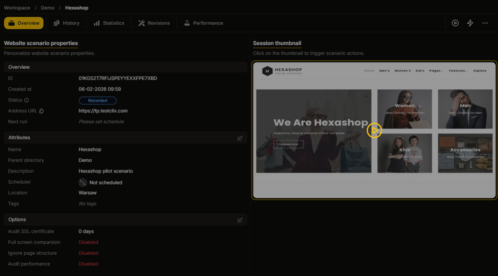
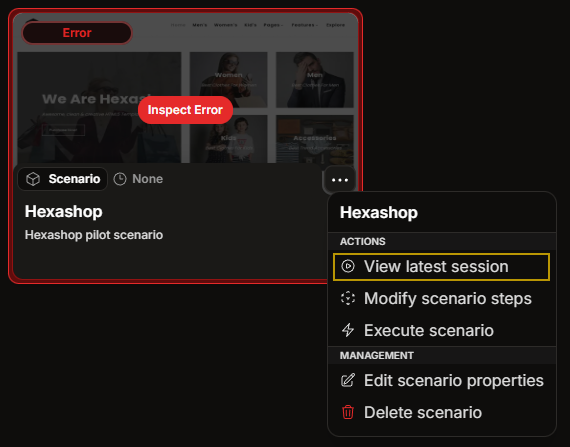

import { Tabs, TabItem, Badge } from '@astrojs/starlight/components';

## Why It Matters

Most monitoring tools tell you that something failed.
The Session Player shows you how it failed.

With **[Website Scenario](/website-scenario/overview)** tests, you do not need to rely only on status codes, logs, or a generic <Badge text="Error" variant="danger"/> state.
You can inspect the browser view from the actual run and see what the user would have seen on screen.

This helps you quickly understand whether the issue was caused by:

- a broken user flow,
- a missing or shifted UI element,
- an unexpected redirect or popup,
- incorrect content on the page,
- or a visual regression that still returned a technically valid response.

## Key Features

The Session Player includes the following features:

- **Session Playback**: Visual reproduction of the recorded user session using application screenshots rendered on a canvas.
- **Session Comparison**: Capabilities to compare the current session against other sessions (e.g., origin vs. error) to identify differences.
- **User Event Simulation**: Visual reconstruction of user interactions, including mouse clicks and other input events.
- **Event Navigation**: Chronological navigation through recorded events via the [Session Timeline](./session-timeline) to inspect specific application states.
- **Combine Screens**: Allows merging the current session when in an error state, effectively marking the new version as valid. This is available only in [pixel comparison](../website-scenario/pixel-comparison.mdx). See [Combine Screens](./combine-screens).

## Error Handling & Comparison

When a session ends with an **error** status, the player facilitates efficient debugging. The failed session can be compared against the original baseline recording to visually identify what changed on the website, not just that the run failed.

Two comparison modes are available:

1. **[Side-by-Side Compare](./side-by-side-compare)**: Displays both sessions adjacent to each other.
2. **[Parallel Compare](./parallel-compare)**: Overlays both sessions for precise visual alignment.

## Accessing the Player

The Session Player can be accessed from multiple locations within the application:

<Tabs>
  <TabItem label="Scenario Details">
    By clicking on the screenshot thumbnail in the scenario details view (only for Scenario tests).
    
  </TabItem>
  <TabItem label="Scenario Dropdowns">
    By selecting the player option from the dropdown menu assigned to a Scenario test.
    
  </TabItem>
</Tabs>

:::note[Automatic Mode Selection]
- <Badge text="Pass" variant="success"/> If the scenario passed, the player opens displaying only the original recording by default.
- <Badge text="Error" variant="danger"/> If the latest run failed, the player automatically opens in **[Side-by-Side](./side-by-side-compare)** comparison mode.
:::
