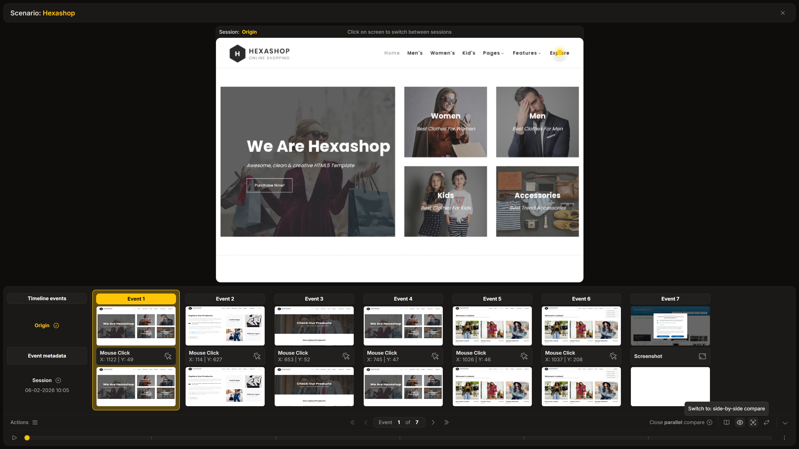

**Parallel Compare** is a specialized mode used for overlaying **images one on top of another**.

## How It Works

In this comparison mode, the player renders two canvas areas in the exact same screen location. Controls allow selecting which layer is displayed on top, or you can simply click on the canvas to toggle between the two sessions in place.

## Purpose

This mode is primarily designed to highlight fine visual details that might be overlooked in a [side-by-side view](./side-by-side-compare). Rapidly toggling between sessions allows for the detection of:
- **Pixel shifts**: Elements that have moved slightly (e.g., a button shifting a few pixels).
- **Layout regressions**: Minor changes in spacing or alignment.

This "blink test" approach makes even the smallest visual differences stand out instantly.