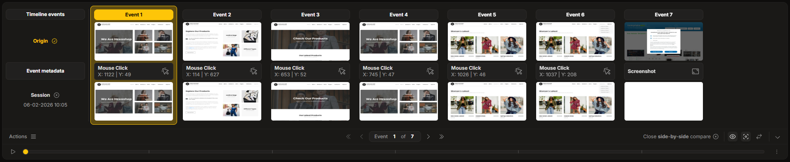
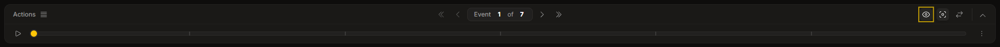
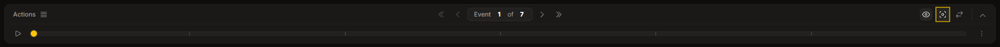
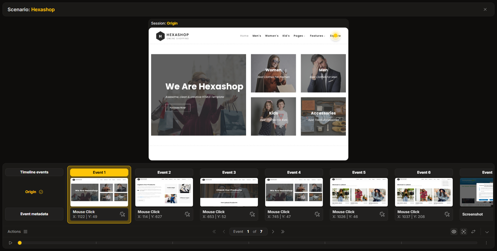
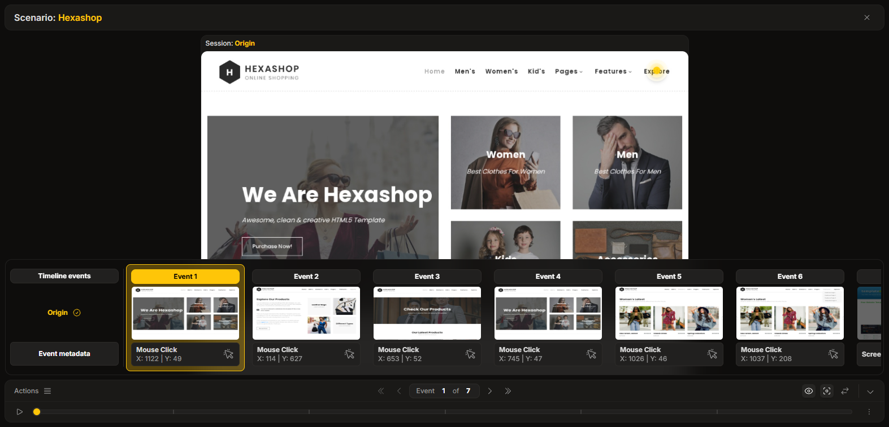

import { Tabs, TabItem } from '@astrojs/starlight/components';

The **Session Timeline** is a fully functional and interactive component that provides granular control over session playback.

## Playback Controls

Controls are available to navigate through events, start, and pause the session playback. Additionally, parameters allow slowing down or speeding up the replay to suit analysis needs.

## Layer Controls

The timeline allows toggling the visibility of different visual layers rendered on the session canvas

### Toggle events replay overlay
  Shows a visual overlay of what was captured during recording. It can be toggled **on** or **off** to view the replay of the event on screen.
  *Examples: mouse clicks, AI prompt areas, image and video checkers, or masked fields.*

  

### Toggle events details layer
  Shows extra event details caused in session replay. It can be toggled **on** or **off** to view the extra details of the event on screen.
  *Examples: areas ignored from comparison, areas that visually do not match when compared.*

  

## Comparing Sessions

Sessions for comparison can be manually selected directly from the timeline. Currently, the system supports searching for and selecting sessions with an **error** status for comparison purposes.

## Visual Modes

The timeline behaves responsively and adapts to available screen space, operating in two modes:

1.  **Dock Mode** (Default): The main timeline (progress bar and controls) is merged with the event thumbnail container, fixed to the bottom of the player.
2.  **Floating Mode**: Used when space is limited or configured. The visual thumbnails are detached from the main control bar.

In both modes, an option exists to hide the event thumbnails entirely to maximize the view of the session canvas.

<Tabs>
  <TabItem label="Dock Mode">
    
  </TabItem>
  <TabItem label="Floating Mode">
    
  </TabItem>
</Tabs>