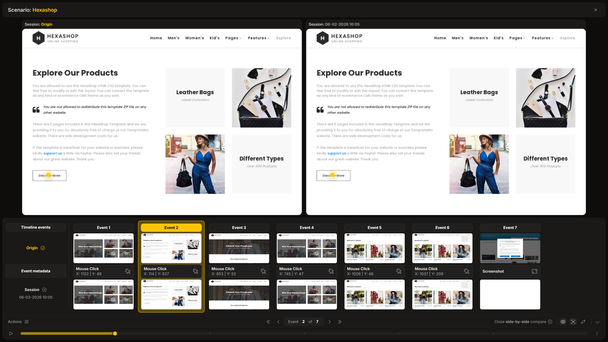

**Side-by-side** is a comparison mode that displays the **origin** session and the current **error** session adjacent to each other simultaneously.

:::note[Default Mode]
This mode is automatically selected by default whenever a session comparison is triggered.
:::

## Purpose

As the name suggests, this mode enables the comparison of differences between two sessions by displaying them side by side. It is the ideal tool for identifying missing elements or structural changes in the UI.

### Common Use Case

This mode is particularly effective when a session fails because an interaction target is missing. For example, if a test fails to click a button because it vanished from the UI:
- **Original Session**: The button is clearly visible.
- **Error Session**: The button is missing.

Seeing these states side by side makes the cause of the failure immediately apparent.
